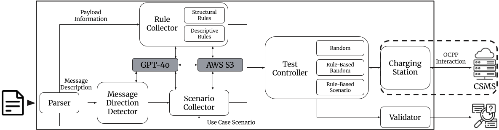
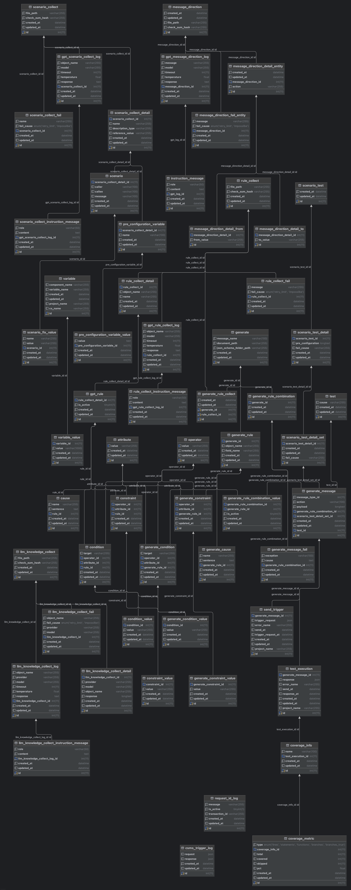

# OCPPuzz
OCPPuzz is an Open Source OCPP Testing Framework for CSMS using GPT.


## Paper Reference

Accepted at FSE 2026.

The camera-ready version of the paper will be available through the ACM Digital Library after publication.

## Table of Contents
- [Prerequisites](#prerequisites)
- [Structure](#structure)
- [Usage](#usage)
- [Data Structure](#data-structure)

## Prerequisites
- Python 3.13+
- Docker
- ODBC Driver 17 for SQL Server
## Structure
```bash
OCPPuzz
├── citrineos-core                        # CSMS Open Source For Test
├── maeve-csms                            # CSMS Open Source For Test
├── ocpp-go                               # CSMS Open Source For Test
├── OCPP.Core                             # CSMS Open Source For Test
├── command                               # Test command for Test Controller
├── constants                             # internal enum constants
├── dataset                               # dataset for test
│   ├── mysql_initdb                      # OCPPuzz Collected Data (message direction, rule, scenario)
│   └── scripts                           # get results from .json class
├── documents                             # parsing documents for # test
├── dto                                   # dto
├── exception                             # Exception handling class
├── extract_scripts                       # extract scripts OCPPuzz Collected Data (message direction, rule, scenario) from database
├── generator_modules                     # class for generator
│   └── constraint                        # constraint for generator (format, item, length, population, size)
│   └── format                            # class for mutate format constraint
│   └── value_config                      # type value config (integer, number, string ..)
├── kafka_modules                         # kafka modules for Test Controller
├── llm_modules                           # llm modules form Collector (message, rule, Scenario) and OCPP LLM knowledge Test
│   └── instruction_config                # instruction config for LLM
│   └── scripts                           # scripts for OCPP LLM knowledge Test
├── paper_scripts                         # scripts extract data from database for paper
├── paser_modules                         # class for parser
│   └── appendices                        # class for parsing ocpp appendices doc
│   └── json                              # class for parsing message *.json
│   └── specification                     # class for parsing specification
├── results                               # validator results data
├── rule_collector_modules                # class for rule collector
├── scenario_collector_modules            # class for scenario collector
├── storage                               # storage
│   └── entity                            # entity class for using orm python sqlalchemy lib
├── test_controller_modules               # class for Test Controller
├── version_config                        # version config
├── csms-docker-compose.sh                # docker-compose scripts for All Open Source CSMS
├── docker-compose.yml                    # OCPPuzz docker-compose: db(-p 4000), kafka(-p 9092), zookeeper(-p 2181)
├── docker-compose-ocpp-core.yml          # OCPP.Core docker-compose: ocpp-core(9281, 9282, 9292, 9291), ocpp-core-management(9299), sqlserver(1433)
├── docker-compose-ocpp-go.yml            # ocpp-go docker-compose: ocpp-go(8887)
├── message_direction_collector.py        # Message Direction Collector script (Require GPT API Token)
├── requirements.txt                      # python lib requirements
├── rule_collector.py                     # Rule Collector script (Require GPT API Token, AWS Bucket)
├── scenario_collector.py                 # Scenario Collector script (Require GPT API Token, AWS Bucket)
├── test_controller.py                    # Test Controller script
└──  validator.py                         # Validator script
```

## Usage
### OCPPuzz Build
  ```shell
  docker-compose -p OCPPuzz -f docker-compose.yml up -d
  ```
### Build All CSMS
  ```shell
  ./csms-docker-compose.sh
  ```
### Build Specific CSMS
  ```shell
  # citrine CSMS build
  docker-compose -p citrine -f citrineos-core/Server/docker-compose-directus.yml up -d
  # OCPP-core CSMS build
  docker-compose -p OCPP-core -f docker-compose-ocpp-core.yml up -d
  # ocpp-go CSMS build
  docker-compose -p ocpp-go -f docker-compose-ocpp-go.yml up -d
  # maeve CSMS build
  docker-compose -p maeve -f maeve-csms/docker-compose.yml up -d
  ```
### Set Target CSMS
```python
# test_controller_modules/test_controller_manager.py
project_list = [
  # Lock off!
  CitrineEventController(test_controller_manager=self),
  # OCPPCoreEventController(test_controller_manager=self),
  # MaeveCsmsEventController(test_controller_manager=self),
  # OCPPGoController(test_controller_manager=self)
]
```
### Execute Test Controller
```shell
python3 test_controller.py
```
### Execute Kafka Command Message
```shell
python3 -m command.scenario_generation_cmd
```
## Data Structure
